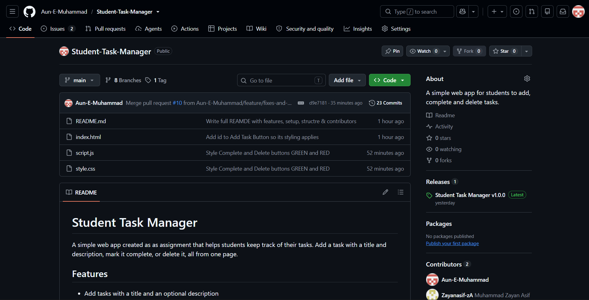
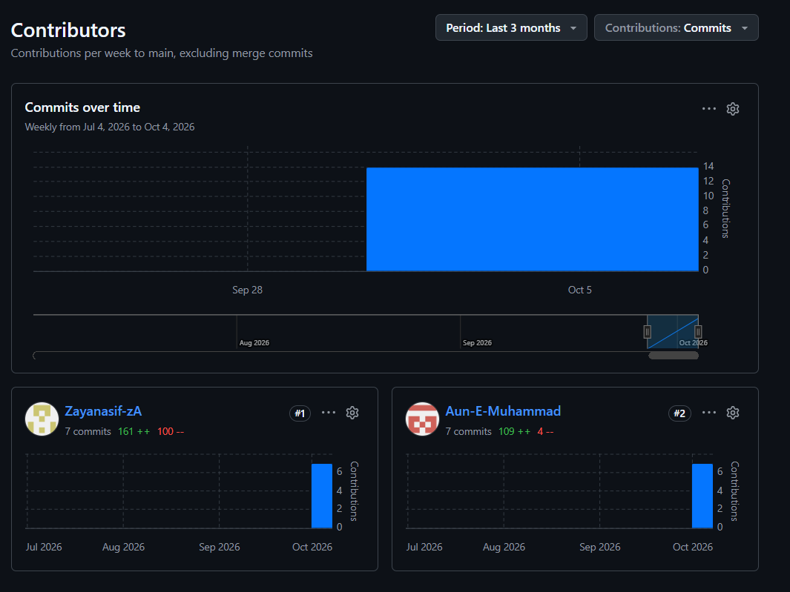

# Student Task Manager

## Project Description

A simple web app that helps students keep track of their tasks. Add a task with a title and description, mark it complete, or delete it, all from one page. The project was built by a pair as a Git & GitHub collaborative assignment, using branches, pull requests and merges to work together.

## Team Members

| Name | Work shown in the commit history |
|---|---|
| Aun-E-Muhammad | Initial project setup, task input form, README, button and heading fixes, merging pull requests |
| Muhammad Zayan Asif | Task manager styling, mobile layout, HTML and styling updates |

## Features

- Add tasks with a title and an optional description
- Mark tasks as complete, and undo if you change your mind
- Delete tasks you no longer need
- Responsive layout that works on desktop and mobile

## Technologies

- HTML
- CSS
- JavaScript (vanilla, no frameworks)
- Git and GitHub for version control and collaboration

## Git Workflow

We used a feature-branch workflow:

1. `main` holds the stable version of the project.
2. Each change was made on its own branch (for example `feature/task-form` or `docs/readme-update`).
3. Changes were committed with a short message and pushed to GitHub.
4. A pull request was opened for the branch and merged into `main`.
5. Both members pulled the latest `main` before starting new work, to stay in sync.
6. A tag (`v1.0.0`) marked the first complete version.

## Branches

| Branch | Purpose |
|---|---|
| `main` | Stable branch with all merged work |
| `feature/task-form` | Task input form |
| `feature/task-style` | Task manager styling |
| `feature/mobile-layout` | Responsive mobile layout |
| `docs/readme-s1` | README title update (first member) |
| `docs/readme-s2` | README title update (second member), merged with `docs/readme-s1` |
| `docs/readme-update` | Full README |
| `feature/fixes-and-improvements` | Add Task button id, centered heading, green and red buttons |

## Git Commands Demonstrated

| Command | Used for |
|---|---|
| `git clone` | Copying the repository to a local machine |
| `git status` | Checking which files changed |
| `git branch` / `git checkout -b` | Listing branches and creating a new one |
| `git add` | Staging changes |
| `git commit -m` | Saving staged changes with a message |
| `git push` / `git push -u origin <branch>` | Uploading commits and linking a new branch to GitHub |
| `git fetch` / `git pull` | Downloading the latest changes from GitHub |
| `git merge` | Combining branches |
| `git revert` | Undoing a commit safely (the "Tempoorary revert test commit") |
| `git tag` | Marking the `v1.0.0` version |
| `git log` / `git diff` | Reviewing history and changes |

## GitHub Features Demonstrated

- **Repository** with a description and README
- **Branches** for each feature and documentation change
- **Pull requests** (#4 to #10) used to merge branches into `main`
- **Collaboration**, with both members pushing branches to the same repository
- **Commit history** showing each member's work
- **Tags** to mark a version (`v1.0.0`)
- **Insights and Contributors** to view each member's contributions

## How to Run

1. Clone the repository:

```bash
   git clone https://github.com/Aun-E-Muhammad/Student-Task-Manager.git
```

2. Open the project folder.
3. Open `index.html` in any web browser. No installation or build step is needed.

## Project Structure

```
Student-Task-Manager/
├── index.html   # Page structure and task form
├── style.css    # Styling and layout
├── script.js    # Task logic (add, complete, delete)
└── README.md
```

## Screenshots

**Figure 35: Final GitHub Repository**



**Figure 36: Team Contributions**



## Version History

| Version | Date | Changes |
|---|---|---|
| v1.0.0 | 2026-10-05 | Task input form, styling, responsive mobile layout, README title updates |
| After v1.0.0 | 2026-10-06 to 2026-10-07 | HTML and styling updates, full README, Add Task button id fix, centered heading, green and red buttons |

## Contributors

- Aun-E-Muhammad
- Muhammad Zayan Asif